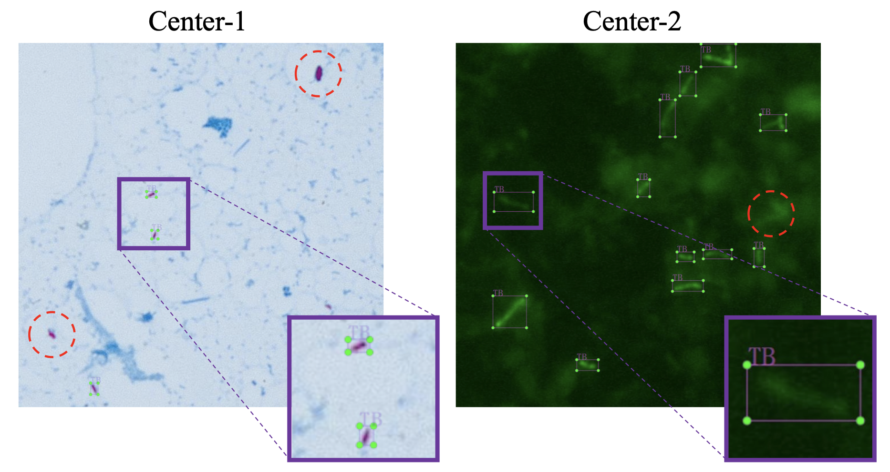
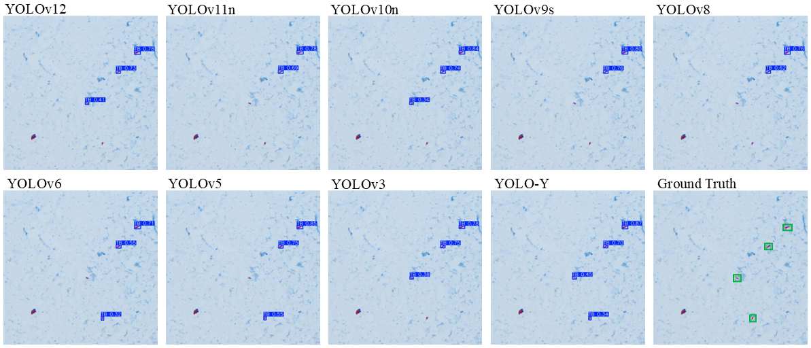

## Visualization

Below are our annotation visualization and result visualization figures.

### Annotation Visualization

  

  <em>Schematic illustration of manual annotation for the Center-1 and Center-2 data. Exemplar <em>Mycobacterium tuberculosis</em> organisms (TB) are enclosed in purple bounding boxes, while regions outlined in red circles indicate negative background areas that are prone to misidentification.</em>

### Result Visualization

  

  <em>Comparative visualization of <em>Mycobacterium tuberculosis</em> detection results from various models on Center-1 data of our Det-Y. Compared to other YOLO-based frameworks, our YOLO-Y yields the most accurate detections.</em>

